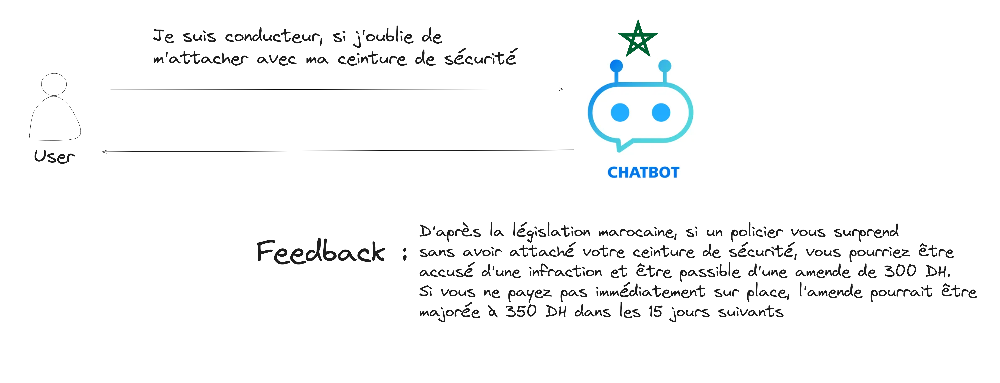
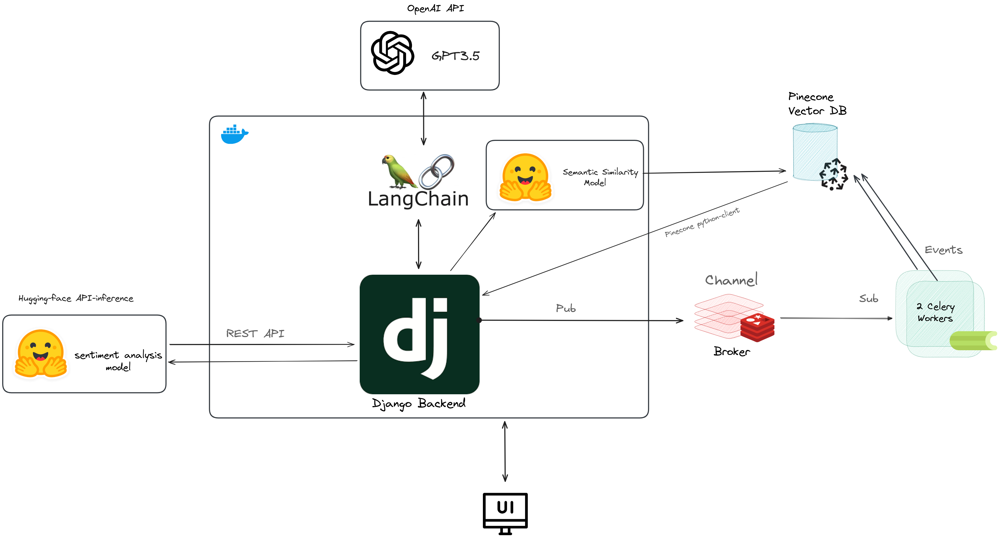

# ChatTrafficViolation
This app was made in a data science hackathon, the app does the following : 

It teaches the user about the moroccan traffic violation law, in the  We have explored that we can categorize the moroccan amendements to 18 classes, after some feature engineering.
We are basically doing clustering instead of clustering as it is easier, faster and also efficient with the use of a vector database. 
The overral backend is as follows : 


To run the app in your local machine : 
1. clone repo
```bash
git clone https://github.com/amine759/ChatTrafficViolation.git
```

- navigate inside the project directory 
```bash
cd ChatTrafficViolation
```
2. install and create virtual environnement in your local machine 
**note: these are linux commands(I use linux btw) look for their equivalent in windows**
```bash
python3 -m venv venv # install virtual environnement
. venv/bin/activate # this is a linux command only
```

3. install all necessary dependencies 
```bash
pip install -r requirements.txt
```
4. You will need to have redis installed, I'm using its docker image. Pull the image and run it. 
```bash
docker pull redis 
docker run -d --name broker redis
```

5. apply django migrations
```bash
python3 manage.py migrate # 
```

6. finally run django server
```bash
python3 manage.py runserver # 
```
**Alternatively you can run the application from its DockerFile**: 
```bash
docker build -t my-app . 
docker run -d my-app . 
```
7. You will also need to run Celery workers, run as much as you want.
```bash
celery -A pro worker --loglevel=DEBUG --concurrency=4 -P eventlet -n worker1
celery -A pro worker --loglevel=DEBUG --concurrency=4 -P eventlet -n worker2
```
